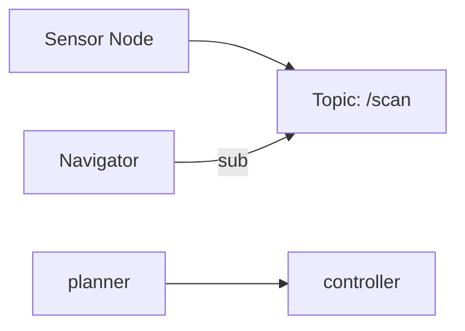

# ROS 2 Architecture

## Summary

This lesson explains nodes, topics, QoS, services, and actions in ROS 2 and how they compose into robot middleware.

## Nodes & Topics (Publisher / Subscriber)

```python
# talker.py (publisher)
import rclpy
from rclpy.node import Node
from std_msgs.msg import String

class Talker(Node):
    def __init__(self):
        super().__init__('talker')
        self.pub = self.create_publisher(String, 'chatter', 10)
        self.create_timer(1.0, self.timer_cb)

    def timer_cb(self):
        msg = String()
        msg.data = 'hello from talker'
        self.pub.publish(msg)
        self.get_logger().info('published')

def main():
    rclpy.init()
    node = Talker()
    rclpy.spin(node)

if __name__ == '__main__':
    main()
```

## Services & Actions

- Services: synchronous request/response patterns (e.g., configure robot)
- Actions: long-running goals with feedback (navigation, manipulation)

```python
# service client sketch (python)
# see ROS 2 tutorials for action server examples
```

## Node graphs (Mermaid)



:::tip
Use `ros2 topic echo` and `ros2 service list` to inspect runtime behavior. Tune QoS for lossy networks or sensors.
:::
