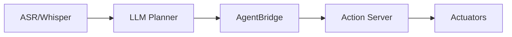

# rclpy & Agent Bridge

## Summary

Patterns for connecting AI agents (LLMs, planners) to ROS 2 systems safely using `rclpy`.

## Recommended Pattern

1. ASR / LLM emits structured plan (JSON)
2. Bridge Service validates plan
3. Bridge publishes to action servers or topics

```python
# agent_bridge.py (sketch)
import rclpy
from rclpy.node import Node
from std_msgs.msg import String

class AgentBridge(Node):
    def __init__(self):
        super().__init__('agent_bridge')
        self.pub = self.create_publisher(String, 'agent/plan', 10)

    def forward_plan(self, plan_json: str):
        # validate plan schema, then publish
        msg = String()
        msg.data = plan_json
        self.pub.publish(msg)

# On the agent side, ensure plans are well-formed and signed if needed
```



:::danger
Never send unvalidated plans to actuators. Always use a validation layer and a supervised 'execute' flag for first runs.
:::
