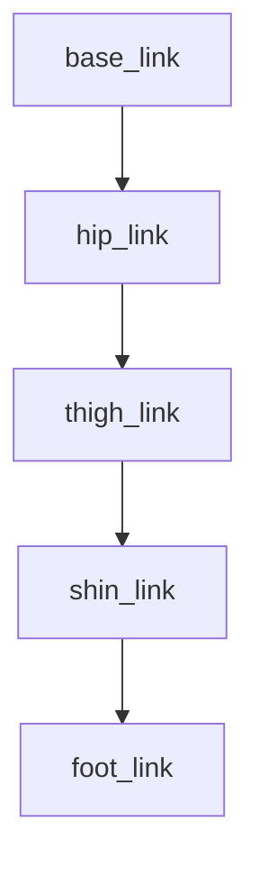

# URDF Anatomy & XACRO

## Summary

URDF (and XACRO) describe a robot's kinematic tree: links, joints, visuals, collisions, inertial properties, and transmission details.

## Example (basic link + joint)

```xml
<!-- hip_leg.xacro -->
<link name="hip_link">
  <inertial>
    <mass value="1.0"/>
    <origin xyz="0 0 0"/>
    <inertia ixx="0.01" ixy="0.0" ixz="0.0" iyy="0.01" iyz="0.0" izz="0.01"/>
  </inertial>
</link>
<joint name="hip_joint" type="continuous">
  <parent link="base_link"/>
  <child link="hip_link"/>
  <origin xyz="0 0 0.1" rpy="0 0 0"/>
</joint>
```

## Best practices

- Use `xacro` to parameterize colors, masses, and dimensions.
- Define realistic inertia values (avoid zeros).
- Provide collision geometry that approximates real parts for faster collision checking.



:::tip
Validate URDF with `check_urdf` and visualize with `rviz2` before using in simulation or on hardware.
:::
