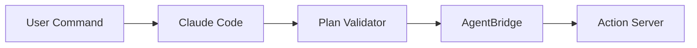

# Claude Code Examples for Module 01

**Purpose:** Provide reproducible Claude Code prompt templates and integration patterns to safely translate natural language into validated ROS 2 action plans.

## Example 1 — Prompt Template: Natural Language → Structured Plan

Prompt (to Claude Code):

```text
You are an assistant that converts high-level natural language commands into a structured JSON plan for a ROS 2 Action Server.
Constraints:
- Only use the allowed actions: ['navigate', 'identify_object', 'pick', 'place', 'wait']
- Produce a JSON object with keys: 'id' (string), 'actions' (list), 'execute' (boolean, default false)
- Each action must include: 'type', 'params' (object), 'timeout_seconds' (number)

Example input:
"Clean the room: go to kitchen, identify the cup on the table, pick it up, and place it in the sink."

Return only the JSON plan.
```

Expected output (example):

```json
{
  "id": "plan-20251220-0001",
  "execute": false,
  "actions": [
    {"type": "navigate", "params": {"goal": "kitchen"}, "timeout_seconds": 60},
    {"type": "identify_object", "params": {"object": "cup", "location": "table"}, "timeout_seconds": 30},
    {"type": "pick", "params": {"object": "cup"}, "timeout_seconds": 20},
    {"type": "place", "params": {"location": "sink"}, "timeout_seconds": 20}
  ]
}
```

:::tip
Design prompts to force structured outputs (JSON/YAML) and include explicit constraints about allowed action types and schema. This makes downstream validation easier.
:::

## Example 2 — Plan Validator (Python)

```python
# plan_validator.py
import jsonschema

PLAN_SCHEMA = {
    "type": "object",
    "required": ["id", "execute", "actions"],
    "properties": {
        "id": {"type": "string"},
        "execute": {"type": "boolean"},
        "actions": {
            "type": "array",
            "items": {
                "type": "object",
                "required": ["type", "params", "timeout_seconds"],
                "properties": {
                    "type": {"type": "string", "enum": ["navigate","identify_object","pick","place","wait"]},
                    "params": {"type": "object"},
                    "timeout_seconds": {"type": "number", "minimum": 0}
                }
            }
        }
    }
}

from jsonschema import validate, ValidationError

def validate_plan(plan_json: dict) -> bool:
    try:
        validate(instance=plan_json, schema=PLAN_SCHEMA)
        # Additional safety checks
        for a in plan_json.get('actions', []):
            if a['timeout_seconds'] > 3600:
                raise ValidationError('timeout too large')
        return True
    except ValidationError as e:
        print('Plan validation error:', e)
        return False
```

:::danger
Always require `execute: false` for initial runs and require an explicit human review or signed token before setting `execute: true` for hardware actuations.
:::

## Example 3 — AgentBridge integration (rclpy)

```python
# agent_bridge_integrate.py
import rclpy
from rclpy.node import Node
from std_msgs.msg import String
import json
from plan_validator import validate_plan

class AgentBridge(Node):
    def __init__(self):
        super().__init__('agent_bridge')
        self.pub = self.create_publisher(String, 'agent/plan', 10)

    def handle_text_command(self, text_command: str, claude_response_json: str):
        plan = json.loads(claude_response_json)
        if not validate_plan(plan):
            self.get_logger().warn('Received invalid plan; aborting')
            return False
        # publish validated plan - downstream systems must still gate execution
        msg = String()
        msg.data = json.dumps(plan)
        self.pub.publish(msg)
        return True
```

## Example 4 — Minimal Claude Code call (pseudocode)

```python
# pseudocode (replace with your Claude Code client)
from claude_code_client import ClaudeCode

client = ClaudeCode(api_key='REDACTED')
plan_json = client.generate(prompt_text)
# validate and forward using the bridge
```



:::tip
Include unit tests that validate the prompt→JSON output round-trips and CI checks that your plan schema doesn't regress. Use recorded example prompts and expected plans as fixtures.
:::
