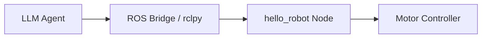

# Module 01 — The Robotic Nervous System (ROS 2)

**Objective:** Establish the middleware foundation for robot control (ROS 2, rclpy bridging, URDF anatomy).

## Key Topics

- **ROS 2 Architecture:** nodes, topics, services, actions
- **Python Bridging:** `rclpy` patterns to connect AI agents to hardware
- **Anatomy of a Humanoid:** URDF basics and best practices

## Deliverable

A working `hello_robot` ROS 2 node and a minimal biped URDF model that can be loaded by ROS tools and simulators.

---

## Module Contents

- [1.01 — Overview](01-01-overview.md)
- [1.02 — ROS 2 Architecture](01-02-ros2-architecture.md)
- [1.03 — rclpy & Agent Bridge](01-03-rclpy-bridging.md)
- [1.04 — URDF Anatomy](01-04-urdf-anatomy.md)
- [1.05 — Lab: Hello Robot](01-05-lab-hello-robot.md)
- [1.06 — Assessment](01-06-assessment.md)
- [1.07 — Claude Code examples](01-07-claude-code.md)

---

## 1. Hello Robot — minimal `rclpy` node

```python
# hello_robot.py
import rclpy
from rclpy.node import Node

class HelloRobot(Node):
    def __init__(self):
        super().__init__('hello_robot')
        self.get_logger().info('Hello Robot: node started')
        self.create_timer(1.0, self._tick)

    def _tick(self):
        self.get_logger().info('Hello Robot: heartbeat')

def main(args=None):
    rclpy.init(args=args)
    node = HelloRobot()
    try:
        rclpy.spin(node)
    except KeyboardInterrupt:
        pass
    finally:
        node.destroy_node()
        rclpy.shutdown()

if __name__ == '__main__':
    main()
```

:::tip
Run with: `ros2 run <package> hello_robot` or `python3 hello_robot.py` during early testing (use a proper package for production). Use `ros2 topic list` to confirm topics.
:::

## 2. Minimal URDF snippet (biped hip and leg link)

```xml
<!-- simple_biped.urdf.xacro (snippet) -->
<robot name="simple_biped">
  <link name="base_link"/>
  <link name="hip_link"/>
  <joint name="hip_joint" type="continuous">
    <parent link="base_link"/>
    <child link="hip_link"/>
  </joint>
  <!-- Continue for thigh, shin, foot -->
</robot>
```

## 3. ROS node graph (Mermaid)



:::danger
**Hardware safety:** Always test with simulation or disabled motors first. Verify emergency stop (E-stop) wiring before connecting to actuators.
:::
