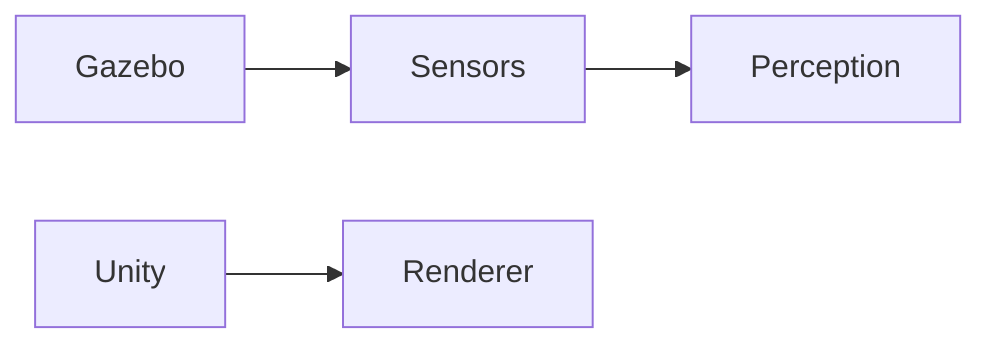

# Module 02 — The Digital Twin (Gazebo & Unity)

**Objective:** Master physics simulation and high‑fidelity environment building for testing robot behaviors safely.

## Key Topics

- **Physics Engines:** gravity, friction, and collision tuning in Gazebo
- **Rendering:** setting up Unity scenes for HRI and visualization
- **Sensor Simulation:** LiDAR, Depth Cameras, IMU streams and synchronization

## Deliverable

A simulation environment where the robot can detect walls/obstacles with simulated sensors.

---

## 1. Gazebo: basic world & physics tweak

```xml
<!-- sample world physics settings -->
<physics type="ode">
  <gravity>0 0 -9.81</gravity>
  <max_contacts>20</max_contacts>
</physics>
```

## 2. Example: publishing fake LiDAR in ROS 2 (Python)

```python
# fake_lidar_publisher.py
import rclpy
from rclpy.node import Node
from sensor_msgs.msg import LaserScan

class FakeLidar(Node):
    def __init__(self):
        super().__init__('fake_lidar')
        self.pub = self.create_publisher(LaserScan, 'scan', 10)
        self.create_timer(0.1, self.timer_cb)

    def timer_cb(self):
        msg = LaserScan()
        # fill ranges, header, angle_min/angle_max as needed
        self.pub.publish(msg)

def main():
    rclpy.init()
    node = FakeLidar()
    rclpy.spin(node)

if __name__ == '__main__':
    main()
```

## 3. Unity: HRI scene tips

- Use Unity's URP for performance and realistic lighting
- Use ROS# or Unity Robotics Hub for ROS <-> Unity integration



:::tip
Prefer parameterized worlds and version-controlled scenes for reproducibility. Record simulation episodes for training datasets.
:::

:::danger
Real-time testing with physical robots must be gated by safety interlocks and supervised by trained personnel.
:::
