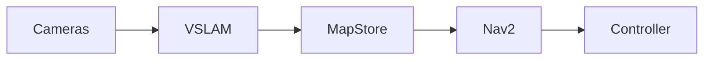

# Module 03 — The AI‑Robot Brain (NVIDIA Isaac™)

**Objective:** Implement perception pipelines and VSLAM to give robots spatial understanding and navigation.

## Key Topics

- **Isaac Sim:** synthetic data generation and physics-accurate sensors
- **Visual SLAM:** integrating Isaac ROS or other VSLAM stacks for mapping
- **Navigation:** Nav2 stacks adapted for bipedal platforms

## Deliverable

A robot agent capable of mapping a room and planning a path from point A to point B using an onboard perception stack.

---

## 1. Isaac Sim: data generation pattern (pseudo-config)

```python
# pseudo: spawn cameras, collect frames, save labels
from omni.isaac.synthetic_utils import spawn_camera

# configure sensor streams and recording
```

## 2. Integrating Visual SLAM

- Use Isaac ROS or OpenVSLAM / ORB-SLAM3 bindings for ROS 2
- Publish transforms and point clouds into TF and map topics



:::tip
Start with prerecorded datasets before running online SLAM with noisy sensors. Use visualization (`rviz2`) to inspect frames and maps.
:::

:::danger
Mapping errors can cause unsafe planning; always validate maps in confined, controlled environments before autonomous runs.
:::
