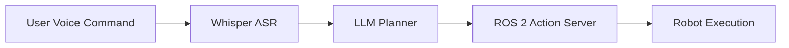

# Module 04 — Vision‑Language‑Action (VLA)

**Objective:** The capstone — integrate voice, LLM planning, perception and control into an autonomous humanoid workflow.

## Key Topics

- **Voice Pipeline:** OpenAI Whisper (or local ASR) for command ingestion
- **Cognitive Logic:** Using LLMs to synthesize ROS 2 action sequences from natural language
- **Action Execution:** Safe mapping from high‑level goals to low‑level ROS actions

## Capstone Deliverable

"The Autonomous Humanoid": a voice command triggers perception, object identification, path planning, and manipulation.

---

## 1. Voice → Intent → Action (example flow)



## 2. Example: parse command and call a ROS 2 action (Python sketch)

```python
# vla_dispatcher.py
import rclpy
from rclpy.node import Node
from some_llm_client import ask_llm
from some_ros_action_msgs.action import ExecuteTask

class VLADispatcher(Node):
    def __init__(self):
        super().__init__('vla_dispatcher')
        # TODO: connect to ASR stream and LLM client

    def handle_command(self, text_command: str):
        plan = ask_llm(text_command)
        # translate plan -> ROS 2 actions and send goal
```

:::tip
Design LLM prompts to emit structured plans (JSON or YAML) that can be easily validated and converted into action goals.
:::

:::danger
Never allow unfiltered LLM outputs to actuate hardware—always validate and run in a supervised mode with safety checks.
:::
