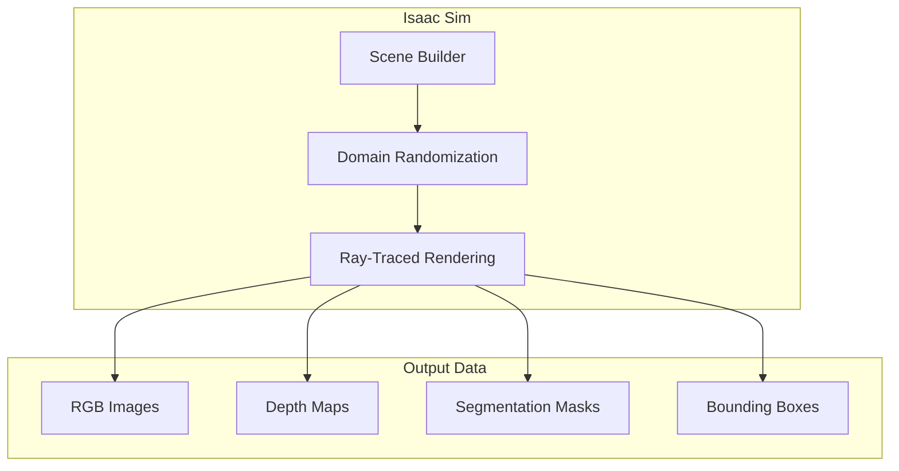

# Isaac Sim: Synthetic Data Generation

:::tip Learning Objective
Use NVIDIA Isaac Sim to generate high-quality synthetic data for training perception models.
:::

## What is Isaac Sim?

**NVIDIA Isaac Sim** is a robotics simulation platform built on Omniverse that provides:
- Photorealistic rendering for vision AI
- Domain randomization for robust training
- Synthetic data generation at scale



## Domain Randomization

```python
"""Domain randomization for synthetic data generation."""

import omni.replicator.core as rep

# Setup domain randomization
with rep.new_layer():
    
    # Randomize lighting
    def randomize_lights():
        lights = rep.get.prim_type("DistantLight")
        with lights:
            rep.modify.attribute("intensity", rep.distribution.uniform(500, 2000))
            rep.modify.attribute("color", rep.distribution.uniform((0.8, 0.8, 0.8), (1, 1, 1)))
        return lights.node
    
    # Randomize object positions
    def randomize_objects():
        objects = rep.get.prims(semantics=[("class", "object")])
        with objects:
            rep.modify.pose(
                position=rep.distribution.uniform((-1, -1, 0.5), (1, 1, 1.5)),
                rotation=rep.distribution.uniform((0, 0, 0), (0, 0, 360))
            )
        return objects.node
    
    # Randomize textures
    def randomize_materials():
        materials = rep.get.material()
        with materials:
            rep.modify.attribute("diffuse_color", 
                rep.distribution.uniform((0.2, 0.2, 0.2), (1.0, 1.0, 1.0)))
        return materials.node
    
    # Register randomizers
    rep.randomizer.register(randomize_lights)
    rep.randomizer.register(randomize_objects)
    rep.randomizer.register(randomize_materials)
    
    # Trigger on each frame
    with rep.trigger.on_frame(num_frames=1000):
        rep.randomizer.randomize_lights()
        rep.randomizer.randomize_objects()
        rep.randomizer.randomize_materials()
```

## Synthetic Data Writer

```python
"""Export synthetic data with annotations."""

import omni.replicator.core as rep

# Create camera
camera = rep.create.camera(position=(2, 2, 2), look_at=(0, 0, 0.5))

# Create render product
render_product = rep.create.render_product(camera, (1280, 720))

# Setup data writer
writer = rep.WriterRegistry.get("BasicWriter")
writer.initialize(
    output_dir="/data/synthetic_dataset",
    rgb=True,
    bounding_box_2d_tight=True,
    semantic_segmentation=True,
    instance_segmentation=True,
    distance_to_camera=True,
    normals=True
)
writer.attach([render_product])

# Generate dataset
rep.orchestrator.run()
```

## Data Format Output

```
synthetic_dataset/
├── rgb/
│   ├── 000000.png
│   ├── 000001.png
│   └── ...
├── bounding_box_2d_tight/
│   ├── 000000.json
│   └── ...
├── semantic_segmentation/
│   ├── 000000.png
│   └── ...
└── camera_params/
    └── params.json
```

---

**Next:** [Visual SLAM →](./visual-slam)


