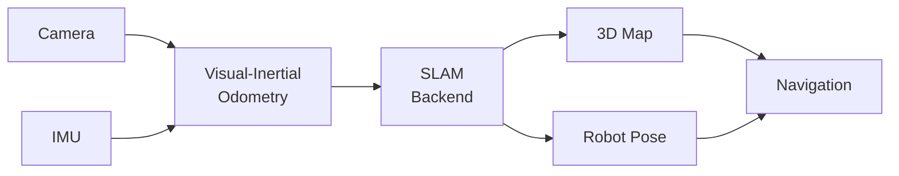

# Visual SLAM: Mapping and Localization

:::tip Learning Objective
Implement Visual SLAM using Isaac ROS for robot mapping and localization.
:::

## SLAM Overview

**SLAM (Simultaneous Localization and Mapping)** solves the chicken-and-egg problem:
- Need a map to know where you are
- Need to know where you are to build a map



## Isaac ROS Visual SLAM Setup

```bash
# Install Isaac ROS packages
sudo apt install ros-humble-isaac-ros-visual-slam

# Clone Isaac ROS workspace
cd ~/ros2_ws/src
git clone https://github.com/NVIDIA-ISAAC-ROS/isaac_ros_common
git clone https://github.com/NVIDIA-ISAAC-ROS/isaac_ros_visual_slam

# Build
cd ~/ros2_ws
colcon build --packages-up-to isaac_ros_visual_slam
```

## Launch Visual SLAM

```python
#!/usr/bin/env python3
"""Launch file for Isaac ROS Visual SLAM."""

from launch import LaunchDescription
from launch_ros.actions import Node


def generate_launch_description():
    
    visual_slam_node = Node(
        package='isaac_ros_visual_slam',
        executable='isaac_ros_visual_slam_node',
        name='visual_slam',
        parameters=[{
            'enable_imu_fusion': True,
            'enable_slam_visualization': True,
            'enable_observations_view': True,
            'enable_landmarks_view': True,
            'map_frame': 'map',
            'odom_frame': 'odom',
            'base_frame': 'base_link',
            'input_left_camera_frame': 'camera_left',
            'input_right_camera_frame': 'camera_right',
            'input_imu_frame': 'imu_link',
        }],
        remappings=[
            ('stereo_camera/left/image', '/camera/left/image_raw'),
            ('stereo_camera/right/image', '/camera/right/image_raw'),
            ('stereo_camera/left/camera_info', '/camera/left/camera_info'),
            ('stereo_camera/right/camera_info', '/camera/right/camera_info'),
            ('visual_slam/imu', '/imu/data'),
        ]
    )
    
    return LaunchDescription([visual_slam_node])
```

## SLAM Processing Node

```python
#!/usr/bin/env python3
"""Process SLAM output for navigation."""

import rclpy
from rclpy.node import Node
from nav_msgs.msg import OccupancyGrid, Odometry
from geometry_msgs.msg import PoseStamped
import numpy as np


class SLAMProcessor(Node):
    """Process SLAM map and pose for navigation decisions."""
    
    def __init__(self):
        super().__init__('slam_processor')
        
        # Subscribe to SLAM outputs
        self.map_sub = self.create_subscription(
            OccupancyGrid, '/map', self.map_callback, 10)
        self.odom_sub = self.create_subscription(
            Odometry, '/visual_slam/odom', self.odom_callback, 10)
        
        # Current state
        self.current_map = None
        self.current_pose = None
        
        self.get_logger().info('SLAM Processor ready')
    
    def map_callback(self, msg: OccupancyGrid):
        """Process occupancy grid map."""
        self.current_map = {
            'width': msg.info.width,
            'height': msg.info.height,
            'resolution': msg.info.resolution,
            'data': np.array(msg.data).reshape(msg.info.height, msg.info.width)
        }
        
        # Count explored area
        explored = np.sum(self.current_map['data'] >= 0)
        total = self.current_map['width'] * self.current_map['height']
        
        self.get_logger().info(
            f'Map: {self.current_map["width"]}x{self.current_map["height"]}, '
            f'Explored: {100*explored/total:.1f}%'
        )
    
    def odom_callback(self, msg: Odometry):
        """Track robot pose from SLAM."""
        self.current_pose = {
            'x': msg.pose.pose.position.x,
            'y': msg.pose.pose.position.y,
            'z': msg.pose.pose.position.z,
        }
    
    def is_area_explored(self, x: float, y: float) -> bool:
        """Check if a world coordinate is in explored area."""
        if self.current_map is None:
            return False
        
        # Convert world to map coordinates
        mx = int(x / self.current_map['resolution'])
        my = int(y / self.current_map['resolution'])
        
        if 0 <= mx < self.current_map['width'] and 0 <= my < self.current_map['height']:
            return self.current_map['data'][my, mx] >= 0
        return False


def main():
    rclpy.init()
    node = SLAMProcessor()
    rclpy.spin(node)
    rclpy.shutdown()


if __name__ == '__main__':
    main()
```

---

**Next:** [Nav2 Navigation →](./nav2-navigation)


