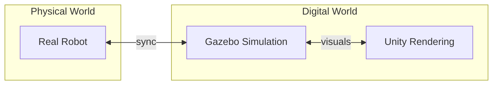

# Physics Engines: Configuring Gazebo Simulation

:::tip Learning Objective
Configure and tune physics simulation parameters in Gazebo for realistic robot behavior.
:::

## Introduction to Digital Twins

A **Digital Twin** is a virtual replica of a physical robot that enables:
- Safe testing before hardware deployment
- Rapid iteration on control algorithms
- Data generation for AI training



## Gazebo Physics Configuration

### World SDF File

```xml
<?xml version="1.0"?>
<sdf version="1.8">
  <world name="humanoid_world">
    
    <!-- Physics Engine Configuration -->
    <physics type="ode">
      <max_step_size>0.001</max_step_size>
      <real_time_factor>1.0</real_time_factor>
      <real_time_update_rate>1000</real_time_update_rate>
      
      <ode>
        <solver>
          <type>quick</type>
          <iters>50</iters>
          <sor>1.3</sor>
        </solver>
        <constraints>
          <cfm>0.0</cfm>
          <erp>0.2</erp>
          <contact_max_correcting_vel>100</contact_max_correcting_vel>
          <contact_surface_layer>0.001</contact_surface_layer>
        </constraints>
      </ode>
    </physics>
    
    <!-- Gravity -->
    <gravity>0 0 -9.81</gravity>
    
    <!-- Ground Plane with Friction -->
    <model name="ground_plane">
      <static>true</static>
      <link name="ground">
        <collision name="collision">
          <geometry>
            <plane>
              <normal>0 0 1</normal>
              <size>100 100</size>
            </plane>
          </geometry>
          <surface>
            <friction>
              <ode>
                <mu>0.8</mu>
                <mu2>0.8</mu2>
              </ode>
            </friction>
          </surface>
        </collision>
      </link>
    </model>
    
    <!-- Lighting -->
    <light type="directional" name="sun">
      <cast_shadows>true</cast_shadows>
      <pose>0 0 10 0 0 0</pose>
      <diffuse>0.8 0.8 0.8 1</diffuse>
    </light>

  </world>
</sdf>
```

### Friction and Contact Parameters

```python
#!/usr/bin/env python3
"""Configure physics parameters programmatically."""

from gazebo_msgs.srv import SetPhysicsProperties
from geometry_msgs.msg import Vector3
import rclpy
from rclpy.node import Node


class PhysicsConfigurator(Node):
    """Configure Gazebo physics at runtime."""
    
    def __init__(self):
        super().__init__('physics_configurator')
        
        self.client = self.create_client(
            SetPhysicsProperties,
            '/gazebo/set_physics_properties'
        )
    
    def set_gravity(self, x: float, y: float, z: float):
        """Set world gravity vector."""
        request = SetPhysicsProperties.Request()
        request.gravity = Vector3(x=x, y=y, z=z)
        request.time_step = 0.001
        request.max_update_rate = 1000.0
        
        future = self.client.call_async(request)
        return future


# Common physics configurations
PHYSICS_PRESETS = {
    'earth': {'gravity': (0, 0, -9.81), 'friction': 0.8},
    'moon': {'gravity': (0, 0, -1.62), 'friction': 0.4},
    'mars': {'gravity': (0, 0, -3.71), 'friction': 0.6},
    'space': {'gravity': (0, 0, 0), 'friction': 0.1},
}
```

## Collision Detection

```xml
<!-- Robot link with collision properties -->
<link name="robot_foot">
  <collision name="foot_collision">
    <geometry>
      <box>
        <size>0.18 0.08 0.04</size>
      </box>
    </geometry>
    <surface>
      <friction>
        <ode>
          <mu>1.0</mu>      <!-- Static friction -->
          <mu2>0.8</mu2>    <!-- Dynamic friction -->
          <slip1>0.0</slip1>
          <slip2>0.0</slip2>
        </ode>
      </friction>
      <contact>
        <ode>
          <kp>1000000.0</kp>  <!-- Contact stiffness -->
          <kd>100.0</kd>       <!-- Contact damping -->
        </ode>
      </contact>
    </surface>
  </collision>
</link>
```

## Launch File Integration

```python
#!/usr/bin/env python3
"""Gazebo launch file for humanoid simulation."""

from launch import LaunchDescription
from launch.actions import IncludeLaunchDescription, DeclareLaunchArgument
from launch.launch_description_sources import PythonLaunchDescriptionSource
from launch.substitutions import LaunchConfiguration, PathJoinSubstitution
from launch_ros.actions import Node
from launch_ros.substitutions import FindPackageShare


def generate_launch_description():
    
    # Paths
    pkg_gazebo_ros = FindPackageShare('gazebo_ros')
    pkg_humanoid = FindPackageShare('humanoid_description')
    
    # World file
    world_file = PathJoinSubstitution([
        pkg_humanoid, 'worlds', 'humanoid_world.sdf'
    ])
    
    # URDF
    urdf_file = PathJoinSubstitution([
        pkg_humanoid, 'urdf', 'bipedal_humanoid.urdf'
    ])
    
    return LaunchDescription([
        # Start Gazebo
        IncludeLaunchDescription(
            PythonLaunchDescriptionSource([
                PathJoinSubstitution([
                    pkg_gazebo_ros, 'launch', 'gazebo.launch.py'
                ])
            ]),
            launch_arguments={'world': world_file}.items()
        ),
        
        # Spawn robot
        Node(
            package='gazebo_ros',
            executable='spawn_entity.py',
            arguments=[
                '-entity', 'humanoid',
                '-file', urdf_file,
                '-x', '0', '-y', '0', '-z', '1.0'
            ],
            output='screen'
        ),
    ])
```

:::danger Simulation Stability
A `max_step_size` that's too large causes instability. Start with 0.001s and only increase if performance is critical and physics remain stable.
:::

---

**Next:** [Unity Rendering →](./unity-rendering)


