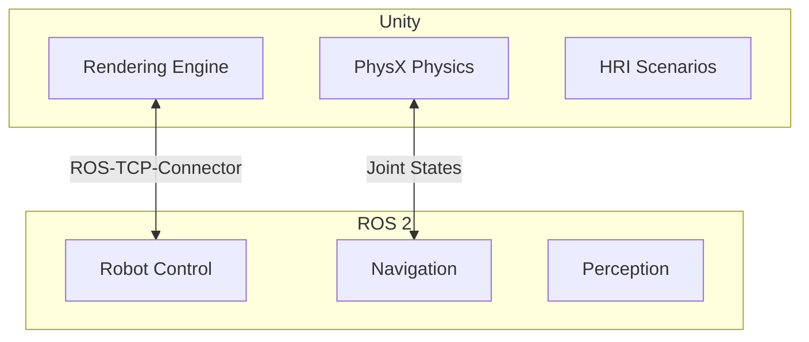

# Unity Rendering for Human-Robot Interaction

:::tip Learning Objective
Set up Unity for high-fidelity visualization and human-robot interaction scenarios.
:::

## Unity + ROS 2 Integration

Unity provides photorealistic rendering while ROS 2 handles robot control:



## ROS-TCP-Connector Setup

```csharp
// Unity C# script for ROS 2 connection
using Unity.Robotics.ROSTCPConnector;
using RosMessageTypes.Geometry;
using UnityEngine;

public class RobotController : MonoBehaviour
{
    private ROSConnection ros;
    private string cmdVelTopic = "/cmd_vel";
    
    void Start()
    {
        // Initialize ROS connection
        ros = ROSConnection.GetOrCreateInstance();
        ros.RegisterPublisher<TwistMsg>(cmdVelTopic);
        
        // Subscribe to joint states
        ros.Subscribe<JointStateMsg>("/joint_states", OnJointState);
    }
    
    void OnJointState(JointStateMsg msg)
    {
        // Update Unity joint positions
        for (int i = 0; i < msg.position.Length; i++)
        {
            UpdateJoint(msg.name[i], (float)msg.position[i]);
        }
    }
    
    void UpdateJoint(string jointName, float position)
    {
        // Find and rotate the corresponding Unity object
        Transform joint = transform.Find(jointName);
        if (joint != null)
        {
            joint.localRotation = Quaternion.Euler(0, 0, position * Mathf.Rad2Deg);
        }
    }
    
    public void SendVelocityCommand(float linear, float angular)
    {
        TwistMsg msg = new TwistMsg();
        msg.linear.x = linear;
        msg.angular.z = angular;
        ros.Publish(cmdVelTopic, msg);
    }
}
```

## Human-Robot Interaction Scenarios

```csharp
// HRI scenario: Human approaching robot
public class HRIScenario : MonoBehaviour
{
    public GameObject humanAvatar;
    public GameObject robot;
    public float safetyDistance = 1.5f;
    
    private ROSConnection ros;
    
    void Start()
    {
        ros = ROSConnection.GetOrCreateInstance();
        ros.RegisterPublisher<BoolMsg>("/human_detected");
    }
    
    void Update()
    {
        float distance = Vector3.Distance(
            humanAvatar.transform.position,
            robot.transform.position
        );
        
        // Publish human proximity
        if (distance < safetyDistance)
        {
            BoolMsg msg = new BoolMsg { data = true };
            ros.Publish("/human_detected", msg);
            
            // Visual feedback - robot glows yellow
            SetRobotColor(Color.yellow);
        }
        else
        {
            SetRobotColor(Color.white);
        }
    }
    
    void SetRobotColor(Color color)
    {
        foreach (var renderer in robot.GetComponentsInChildren<Renderer>())
        {
            renderer.material.color = color;
        }
    }
}
```

---

**Next:** [Sensor Simulation →](./sensor-simulation)


