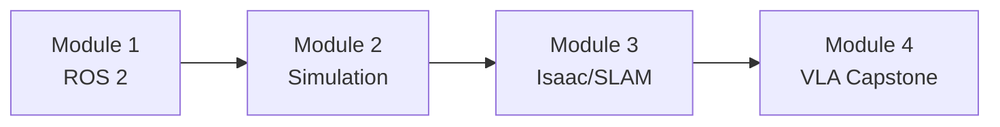

# Physical AI & Humanoid Robotics

:::tip Welcome
This is an **AI-Native Textbook** designed for learning at the intersection of artificial intelligence and physical robotics. The content is structured for both human comprehension and AI-assisted learning.
:::

## Course Overview

This curriculum takes you from **ROS 2 fundamentals** to building a complete **voice-controlled autonomous humanoid robot**.



## The Four Modules

| Module | Title | Objective | Deliverable |
|--------|-------|-----------|-------------|
| **01** | The Robotic Nervous System | ROS 2 middleware foundation | Hello Robot node + URDF model |
| **02** | The Digital Twin | Physics simulation & sensors | Environment with obstacle sensing |
| **03** | The AI-Robot Brain | Perception & navigation | Robot that maps and navigates |
| **04** | Vision-Language-Action | LLM + voice integration | Autonomous humanoid (Capstone) |

## Prerequisites

Before starting, you should have:

- **Python 3.10+** programming experience
- Basic understanding of **Linux command line**
- Familiarity with **object-oriented programming**
- A computer with **Ubuntu 22.04** (or WSL2 on Windows)

## Technology Stack

```mermaid
graph TB
    subgraph "Software"
        ROS2[ROS 2 Humble]
        GAZEBO[Gazebo Sim]
        ISAAC[NVIDIA Isaac]
        WHISPER[OpenAI Whisper]
        GPT[LLM - GPT-4]
    end
    
    subgraph "Languages"
        PYTHON[Python 3.10+]
        CPP[C++ (optional)]
        XML[XML/URDF]
    end
```

## Learning Path

### Module 1: The Robotic Nervous System (ROS 2)
- ROS 2 Architecture: Nodes, Topics, Services, Actions
- Python Bridging with `rclpy`
- URDF: Anatomy of a Humanoid

### Module 2: The Digital Twin (Gazebo & Unity)
- Physics Engines: Configuring Gazebo
- Unity Rendering for HRI
- Sensor Simulation: LiDAR, Depth, IMU

### Module 3: The AI-Robot Brain (NVIDIA Isaac)
- Isaac Sim: Synthetic Data Generation
- Visual SLAM: Mapping and Localization
- Nav2: Autonomous Navigation

### Module 4: Vision-Language-Action (VLA) — Capstone
- Voice Pipeline: OpenAI Whisper
- Cognitive Logic: LLM Task Planning
- **Capstone**: The Autonomous Humanoid

## Using This Textbook with AI

This curriculum is designed to work seamlessly with AI coding assistants:

```python
# Example: Ask Claude to help you understand a concept
"""
@claude: Explain how ROS 2 topics work and show me 
an example publisher/subscriber in Python
"""
```

:::tip AI-Assisted Learning
Use AI assistants to:
- Explain complex concepts in simpler terms
- Debug your ROS 2 code
- Generate variations of example code
- Answer questions about robotics theory
:::

## Ready to Begin?

**[Start Module 1: The Robotic Nervous System →](/docs/robotic-nervous-system/ros2-architecture)**

---

*This textbook embodies the principle of Human-Agent-Robot Symbiosis — where humans provide direction, AI agents assist with reasoning, and robots execute in the physical world.*


