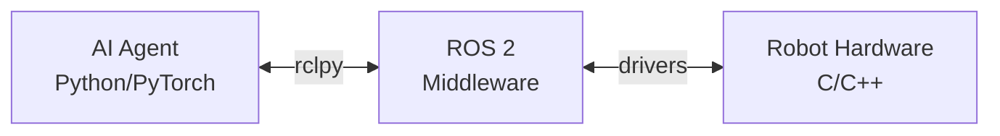

# Python Bridging: Connecting AI Agents with Hardware

:::tip Learning Objective
Learn to implement `rclpy` (ROS Client Library for Python) to bridge AI agents with physical robot hardware.
:::

## Why Python for Robotics?

Python serves as the perfect bridge between high-level AI systems and low-level robot control:



## Setting Up rclpy

### Installation

```bash
# Ubuntu 22.04 with ROS 2 Humble
sudo apt install ros-humble-rclpy

# Verify installation
python3 -c "import rclpy; print('rclpy ready!')"
```

### Package Structure

```
my_robot_package/
├── my_robot_package/
│   ├── __init__.py
│   ├── hello_robot.py        # Your first node
│   └── ai_bridge.py          # AI integration
├── resource/
│   └── my_robot_package
├── package.xml
├── setup.py
└── setup.cfg
```

## The AI-Robot Bridge Pattern

```python
#!/usr/bin/env python3
"""
AI-Robot Bridge: Connects language models to robot actions.
"""

import rclpy
from rclpy.node import Node
from geometry_msgs.msg import Twist, PoseStamped
from sensor_msgs.msg import Image, LaserScan
from std_msgs.msg import String
from cv_bridge import CvBridge
import numpy as np


class AIRobotBridge(Node):
    """
    Bridge between AI agents (LLMs, vision models) and ROS 2.
    
    This node:
    - Receives sensor data and converts to AI-friendly formats
    - Accepts high-level commands from AI and translates to ROS actions
    - Provides feedback to AI about robot state
    """
    
    def __init__(self):
        super().__init__('ai_robot_bridge')
        
        # CV Bridge for image conversion
        self.cv_bridge = CvBridge()
        
        # === SENSOR SUBSCRIPTIONS ===
        self.image_sub = self.create_subscription(
            Image, '/camera/rgb/image_raw',
            self.image_callback, 10
        )
        
        self.scan_sub = self.create_subscription(
            LaserScan, '/scan',
            self.scan_callback, 10
        )
        
        # === COMMAND PUBLISHERS ===
        self.vel_pub = self.create_publisher(Twist, '/cmd_vel', 10)
        self.goal_pub = self.create_publisher(PoseStamped, '/goal_pose', 10)
        
        # === AI INTERFACE ===
        self.ai_command_sub = self.create_subscription(
            String, '/ai/command',
            self.ai_command_callback, 10
        )
        
        self.ai_feedback_pub = self.create_publisher(
            String, '/ai/feedback', 10
        )
        
        # State storage
        self.latest_image = None
        self.latest_scan = None
        
        self.get_logger().info('AI-Robot Bridge initialized')
    
    # === SENSOR CALLBACKS ===
    
    def image_callback(self, msg: Image):
        """Convert ROS Image to numpy array for AI processing."""
        try:
            # Convert to OpenCV format (numpy array)
            self.latest_image = self.cv_bridge.imgmsg_to_cv2(
                msg, desired_encoding='rgb8'
            )
        except Exception as e:
            self.get_logger().error(f'Image conversion failed: {e}')
    
    def scan_callback(self, msg: LaserScan):
        """Process LiDAR scan for obstacle detection."""
        self.latest_scan = {
            'ranges': np.array(msg.ranges),
            'angle_min': msg.angle_min,
            'angle_max': msg.angle_max,
            'range_min': msg.range_min,
            'range_max': msg.range_max
        }
        
        # Detect closest obstacle
        valid_ranges = [r for r in msg.ranges if msg.range_min < r < msg.range_max]
        if valid_ranges:
            min_distance = min(valid_ranges)
            if min_distance < 0.5:
                self.get_logger().warn(f'Obstacle at {min_distance:.2f}m!')
    
    # === AI COMMAND INTERFACE ===
    
    def ai_command_callback(self, msg: String):
        """
        Process high-level commands from AI agent.
        
        Supported commands:
        - "move_forward": Move ahead at 0.3 m/s
        - "turn_left": Rotate left 45 degrees
        - "turn_right": Rotate right 45 degrees  
        - "stop": Emergency stop
        - "navigate X Y": Go to coordinates
        """
        command = msg.data.lower().strip()
        self.get_logger().info(f'AI Command: {command}')
        
        if command == "move_forward":
            self.move(linear=0.3, angular=0.0)
            self.send_feedback("Moving forward")
            
        elif command == "turn_left":
            self.move(linear=0.0, angular=0.5)
            self.send_feedback("Turning left")
            
        elif command == "turn_right":
            self.move(linear=0.0, angular=-0.5)
            self.send_feedback("Turning right")
            
        elif command == "stop":
            self.move(linear=0.0, angular=0.0)
            self.send_feedback("Stopped")
            
        elif command.startswith("navigate"):
            parts = command.split()
            if len(parts) == 3:
                x, y = float(parts[1]), float(parts[2])
                self.navigate_to(x, y)
                self.send_feedback(f"Navigating to ({x}, {y})")
        else:
            self.send_feedback(f"Unknown command: {command}")
    
    # === ACTION METHODS ===
    
    def move(self, linear: float, angular: float):
        """Publish velocity command."""
        msg = Twist()
        msg.linear.x = linear
        msg.angular.z = angular
        self.vel_pub.publish(msg)
    
    def navigate_to(self, x: float, y: float):
        """Publish navigation goal."""
        goal = PoseStamped()
        goal.header.frame_id = 'map'
        goal.header.stamp = self.get_clock().now().to_msg()
        goal.pose.position.x = x
        goal.pose.position.y = y
        goal.pose.orientation.w = 1.0
        self.goal_pub.publish(goal)
    
    def send_feedback(self, message: str):
        """Send feedback to AI agent."""
        msg = String()
        msg.data = message
        self.ai_feedback_pub.publish(msg)
    
    # === AI DATA ACCESS ===
    
    def get_image_for_ai(self) -> np.ndarray:
        """Return latest camera image as numpy array."""
        return self.latest_image
    
    def get_obstacle_info(self) -> dict:
        """Return obstacle information for AI reasoning."""
        if self.latest_scan is None:
            return {'clear': True}
        
        ranges = self.latest_scan['ranges']
        valid = ranges[(ranges > 0.1) & (ranges < 10.0)]
        
        if len(valid) == 0:
            return {'clear': True}
        
        return {
            'clear': valid.min() > 1.0,
            'min_distance': float(valid.min()),
            'mean_distance': float(valid.mean())
        }


def main(args=None):
    rclpy.init(args=args)
    bridge = AIRobotBridge()
    
    try:
        rclpy.spin(bridge)
    except KeyboardInterrupt:
        pass
    finally:
        bridge.destroy_node()
        rclpy.shutdown()


if __name__ == '__main__':
    main()
```

## Deliverable: "Hello Robot" Node

```python
#!/usr/bin/env python3
"""
hello_robot.py - Your first ROS 2 node!

This node demonstrates:
1. Node creation with rclpy
2. Timer callbacks
3. Logging
4. Parameter handling
"""

import rclpy
from rclpy.node import Node


class HelloRobotNode(Node):
    """A friendly introductory node."""
    
    def __init__(self):
        super().__init__('hello_robot')
        
        # Declare a parameter
        self.declare_parameter('robot_name', 'Atlas')
        self.robot_name = self.get_parameter('robot_name').value
        
        # Create a 1 Hz timer
        self.timer = self.create_timer(1.0, self.say_hello)
        self.count = 0
        
        self.get_logger().info(f'🤖 {self.robot_name} is online!')
    
    def say_hello(self):
        """Print a friendly message."""
        self.count += 1
        self.get_logger().info(
            f'Hello from {self.robot_name}! Count: {self.count}'
        )


def main(args=None):
    rclpy.init(args=args)
    node = HelloRobotNode()
    
    try:
        rclpy.spin(node)
    except KeyboardInterrupt:
        node.get_logger().info('Shutting down...')
    finally:
        node.destroy_node()
        rclpy.shutdown()


if __name__ == '__main__':
    main()
```

### Running the Hello Robot Node

```bash
# Terminal 1: Run the node
ros2 run my_robot_package hello_robot

# Terminal 2: Change the robot name parameter
ros2 run my_robot_package hello_robot --ros-args -p robot_name:=Optimus
```

:::tip Deliverable Checkpoint
✅ You should now have a working "Hello Robot" node that:
- Initializes with rclpy
- Uses timer callbacks
- Logs messages to the console
- Accepts parameters
:::

---

**Next:** [Anatomy of a Humanoid (URDF) →](./urdf-anatomy)


