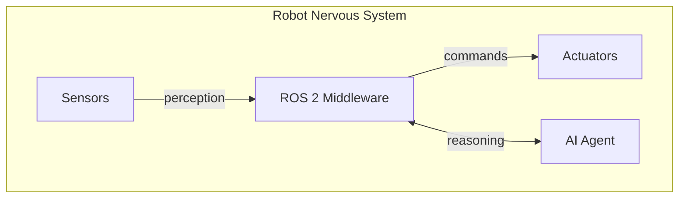
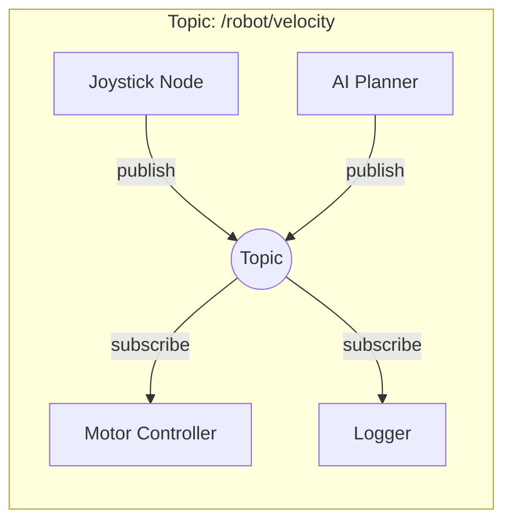
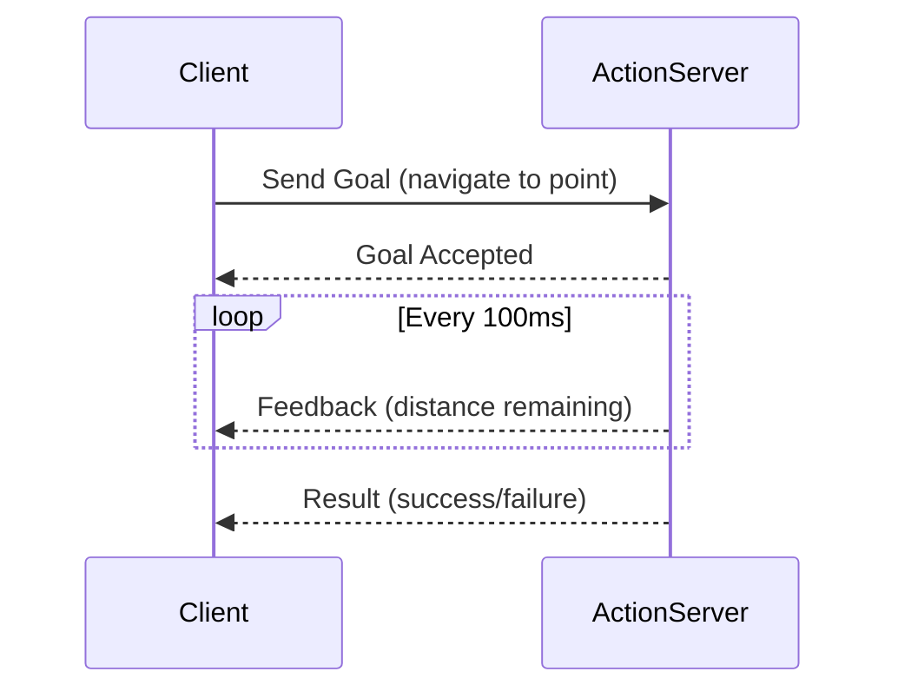
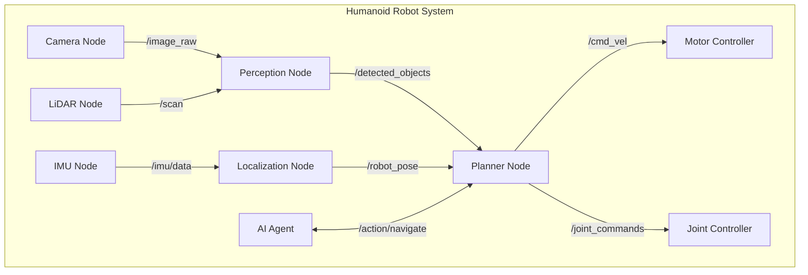

# ROS 2 Architecture: Nodes, Topics, Services, and Actions

:::tip Learning Objective
By the end of this lesson, you will understand the core communication patterns in ROS 2 and how they form the "nervous system" of a robot.
:::

## Introduction to ROS 2

**ROS 2 (Robot Operating System 2)** is not an operating system, but a middleware framework that provides the communication infrastructure for robotic systems. Think of it as the **nervous system** of a robot—connecting sensors (perception), processing (cognition), and actuators (action).



## Core Concepts

### Nodes: The Processing Units

A **Node** is an independent process that performs computation. Each node should be responsible for a single, modular purpose.

```python
#!/usr/bin/env python3
"""A minimal ROS 2 node example."""

import rclpy
from rclpy.node import Node


class MinimalNode(Node):
    """A simple ROS 2 node that logs a message."""
    
    def __init__(self):
        super().__init__('minimal_node')
        self.get_logger().info('Hello from the Robotic Nervous System!')
        
        # Create a timer that fires every second
        self.timer = self.create_timer(1.0, self.timer_callback)
        self.counter = 0
    
    def timer_callback(self):
        """Called every second by the timer."""
        self.counter += 1
        self.get_logger().info(f'Heartbeat #{self.counter}')


def main(args=None):
    rclpy.init(args=args)
    node = MinimalNode()
    
    try:
        rclpy.spin(node)
    except KeyboardInterrupt:
        pass
    finally:
        node.destroy_node()
        rclpy.shutdown()


if __name__ == '__main__':
    main()
```

### Topics: Publish-Subscribe Communication

**Topics** enable asynchronous, one-to-many communication. Publishers send messages without knowing who receives them.



```python
#!/usr/bin/env python3
"""Publisher and subscriber example."""

import rclpy
from rclpy.node import Node
from geometry_msgs.msg import Twist


class VelocityPublisher(Node):
    """Publishes velocity commands to a robot."""
    
    def __init__(self):
        super().__init__('velocity_publisher')
        
        # Create a publisher on the /cmd_vel topic
        self.publisher = self.create_publisher(
            Twist,           # Message type
            '/cmd_vel',      # Topic name
            10               # Queue size
        )
        
        # Publish at 10 Hz
        self.timer = self.create_timer(0.1, self.publish_velocity)
        self.get_logger().info('Velocity publisher started')
    
    def publish_velocity(self):
        """Publish a velocity command."""
        msg = Twist()
        msg.linear.x = 0.5   # Forward velocity (m/s)
        msg.angular.z = 0.1  # Rotation velocity (rad/s)
        
        self.publisher.publish(msg)


class VelocitySubscriber(Node):
    """Subscribes to velocity commands."""
    
    def __init__(self):
        super().__init__('velocity_subscriber')
        
        self.subscription = self.create_subscription(
            Twist,
            '/cmd_vel',
            self.velocity_callback,
            10
        )
        self.get_logger().info('Velocity subscriber started')
    
    def velocity_callback(self, msg: Twist):
        """Process received velocity command."""
        self.get_logger().info(
            f'Received: linear={msg.linear.x:.2f}, angular={msg.angular.z:.2f}'
        )
```

### Services: Request-Response Pattern

**Services** provide synchronous, one-to-one communication for discrete operations.

```python
#!/usr/bin/env python3
"""Service server and client example."""

from example_interfaces.srv import AddTwoInts
import rclpy
from rclpy.node import Node


class CalculatorService(Node):
    """A service that adds two integers."""
    
    def __init__(self):
        super().__init__('calculator_service')
        
        self.srv = self.create_service(
            AddTwoInts,
            'add_two_ints',
            self.add_callback
        )
        self.get_logger().info('Calculator service ready')
    
    def add_callback(self, request, response):
        """Handle addition request."""
        response.sum = request.a + request.b
        self.get_logger().info(f'{request.a} + {request.b} = {response.sum}')
        return response


class CalculatorClient(Node):
    """A client that calls the calculator service."""
    
    def __init__(self):
        super().__init__('calculator_client')
        self.client = self.create_client(AddTwoInts, 'add_two_ints')
        
        # Wait for service to be available
        while not self.client.wait_for_service(timeout_sec=1.0):
            self.get_logger().info('Waiting for service...')
    
    def send_request(self, a: int, b: int):
        """Send addition request."""
        request = AddTwoInts.Request()
        request.a = a
        request.b = b
        
        future = self.client.call_async(request)
        return future
```

### Actions: Long-Running Tasks

**Actions** handle tasks that take time to complete, with feedback and cancellation support.



```python
#!/usr/bin/env python3
"""Action server example for navigation."""

import time
import rclpy
from rclpy.node import Node
from rclpy.action import ActionServer
from nav2_msgs.action import NavigateToPose


class NavigationActionServer(Node):
    """Action server for robot navigation."""
    
    def __init__(self):
        super().__init__('navigation_action_server')
        
        self._action_server = ActionServer(
            self,
            NavigateToPose,
            'navigate_to_pose',
            self.execute_callback
        )
        self.get_logger().info('Navigation action server ready')
    
    async def execute_callback(self, goal_handle):
        """Execute the navigation goal."""
        self.get_logger().info('Executing navigation goal...')
        
        feedback_msg = NavigateToPose.Feedback()
        
        # Simulate navigation with feedback
        for i in range(10):
            # Check if cancelled
            if goal_handle.is_cancel_requested:
                goal_handle.canceled()
                return NavigateToPose.Result()
            
            # Send progress feedback
            feedback_msg.distance_remaining = float(10 - i)
            goal_handle.publish_feedback(feedback_msg)
            
            time.sleep(0.5)
        
        goal_handle.succeed()
        
        result = NavigateToPose.Result()
        return result
```

## ROS 2 Node Graph Visualization



## Summary

| Concept | Pattern | Use Case |
|---------|---------|----------|
| **Node** | Process | Independent computation unit |
| **Topic** | Pub/Sub | Sensor streams, continuous data |
| **Service** | Request/Response | Quick queries, state changes |
| **Action** | Goal/Feedback/Result | Long-running tasks (navigation) |

:::danger Hardware Safety
When controlling real robot hardware, always implement emergency stop mechanisms. Never rely solely on software for safety-critical operations.
:::

---

**Next:** [Python Bridging with rclpy →](./python-bridging)


