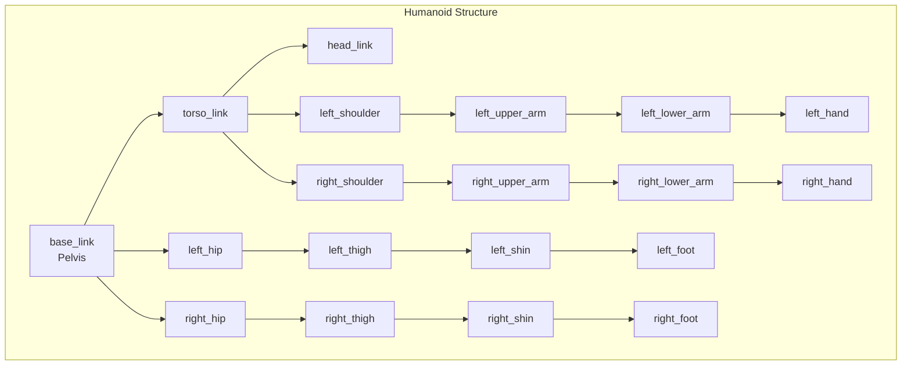

# Anatomy of a Humanoid: Understanding URDF

:::tip Learning Objective
Master the **Unified Robot Description Format (URDF)** to define the physical structure of humanoid robots for simulation and control.
:::

## What is URDF?

**URDF (Unified Robot Description Format)** is an XML format that describes a robot's physical configuration:

- **Links**: Rigid body segments (torso, arms, legs)
- **Joints**: Connections between links (revolute, prismatic, fixed)
- **Visual/Collision Geometry**: 3D meshes for rendering and physics
- **Inertial Properties**: Mass and moments of inertia



## URDF Structure

### Basic Elements

```xml
<?xml version="1.0"?>
<robot name="simple_humanoid" xmlns:xacro="http://ros.org/wiki/xacro">
  
  <!-- Materials for visualization -->
  <material name="blue">
    <color rgba="0.2 0.4 0.8 1.0"/>
  </material>
  
  <material name="grey">
    <color rgba="0.5 0.5 0.5 1.0"/>
  </material>
  
  <!-- Root link (pelvis) -->
  <link name="base_link">
    <visual>
      <geometry>
        <box size="0.3 0.2 0.15"/>
      </geometry>
      <material name="grey"/>
    </visual>
    <collision>
      <geometry>
        <box size="0.3 0.2 0.15"/>
      </geometry>
    </collision>
    <inertial>
      <mass value="5.0"/>
      <inertia ixx="0.05" ixy="0" ixz="0" 
               iyy="0.05" iyz="0" izz="0.05"/>
    </inertial>
  </link>

</robot>
```

### Links: The Body Segments

```xml
<!-- Torso Link -->
<link name="torso_link">
  <visual>
    <origin xyz="0 0 0.2" rpy="0 0 0"/>
    <geometry>
      <cylinder radius="0.15" length="0.4"/>
    </geometry>
    <material name="blue"/>
  </visual>
  
  <collision>
    <origin xyz="0 0 0.2" rpy="0 0 0"/>
    <geometry>
      <cylinder radius="0.15" length="0.4"/>
    </geometry>
  </collision>
  
  <inertial>
    <origin xyz="0 0 0.2"/>
    <mass value="10.0"/>
    <inertia ixx="0.1" ixy="0" ixz="0" 
             iyy="0.1" iyz="0" izz="0.05"/>
  </inertial>
</link>
```

### Joints: The Connections

```xml
<!-- Waist Joint (connects pelvis to torso) -->
<joint name="waist_joint" type="revolute">
  <parent link="base_link"/>
  <child link="torso_link"/>
  <origin xyz="0 0 0.1" rpy="0 0 0"/>
  <axis xyz="0 0 1"/>  <!-- Rotation around Z (yaw) -->
  <limit lower="-1.57" upper="1.57" 
         effort="100" velocity="1.0"/>
</joint>
```

### Joint Types

| Type | DOF | Description | Use Case |
|------|-----|-------------|----------|
| `revolute` | 1 | Rotation with limits | Elbow, knee |
| `continuous` | 1 | Unlimited rotation | Wheels |
| `prismatic` | 1 | Linear translation | Lift mechanisms |
| `fixed` | 0 | No motion | Sensor mounts |
| `floating` | 6 | Free 6-DOF motion | Mobile base |
| `planar` | 2 | Motion in a plane | Specialized |

## Complete Bipedal Humanoid URDF

```xml
<?xml version="1.0"?>
<robot name="bipedal_humanoid" xmlns:xacro="http://ros.org/wiki/xacro">
  
  <!-- ==================== MATERIALS ==================== -->
  <material name="blue">
    <color rgba="0.2 0.4 0.9 1.0"/>
  </material>
  <material name="orange">
    <color rgba="0.9 0.5 0.2 1.0"/>
  </material>
  <material name="grey">
    <color rgba="0.6 0.6 0.6 1.0"/>
  </material>
  
  <!-- ==================== BASE (PELVIS) ==================== -->
  <link name="base_link">
    <visual>
      <geometry>
        <box size="0.25 0.3 0.12"/>
      </geometry>
      <material name="grey"/>
    </visual>
    <collision>
      <geometry>
        <box size="0.25 0.3 0.12"/>
      </geometry>
    </collision>
    <inertial>
      <mass value="5.0"/>
      <inertia ixx="0.04" ixy="0" ixz="0" 
               iyy="0.05" iyz="0" izz="0.04"/>
    </inertial>
  </link>
  
  <!-- ==================== TORSO ==================== -->
  <link name="torso_link">
    <visual>
      <origin xyz="0 0 0.18"/>
      <geometry>
        <cylinder radius="0.12" length="0.36"/>
      </geometry>
      <material name="blue"/>
    </visual>
    <collision>
      <origin xyz="0 0 0.18"/>
      <geometry>
        <cylinder radius="0.12" length="0.36"/>
      </geometry>
    </collision>
    <inertial>
      <mass value="8.0"/>
      <origin xyz="0 0 0.18"/>
      <inertia ixx="0.08" ixy="0" ixz="0" 
               iyy="0.08" iyz="0" izz="0.04"/>
    </inertial>
  </link>
  
  <joint name="waist_joint" type="revolute">
    <parent link="base_link"/>
    <child link="torso_link"/>
    <origin xyz="0 0 0.08"/>
    <axis xyz="0 0 1"/>
    <limit lower="-0.5" upper="0.5" effort="100" velocity="2"/>
  </joint>
  
  <!-- ==================== HEAD ==================== -->
  <link name="head_link">
    <visual>
      <geometry>
        <sphere radius="0.1"/>
      </geometry>
      <material name="orange"/>
    </visual>
    <collision>
      <geometry>
        <sphere radius="0.1"/>
      </geometry>
    </collision>
    <inertial>
      <mass value="2.0"/>
      <inertia ixx="0.008" ixy="0" ixz="0" 
               iyy="0.008" iyz="0" izz="0.008"/>
    </inertial>
  </link>
  
  <joint name="neck_joint" type="revolute">
    <parent link="torso_link"/>
    <child link="head_link"/>
    <origin xyz="0 0 0.42"/>
    <axis xyz="0 1 0"/>  <!-- Pitch -->
    <limit lower="-0.5" upper="0.5" effort="20" velocity="2"/>
  </joint>
  
  <!-- ==================== LEFT LEG ==================== -->
  <!-- Left Thigh -->
  <link name="left_thigh_link">
    <visual>
      <origin xyz="0 0 -0.15"/>
      <geometry>
        <cylinder radius="0.05" length="0.3"/>
      </geometry>
      <material name="blue"/>
    </visual>
    <collision>
      <origin xyz="0 0 -0.15"/>
      <geometry>
        <cylinder radius="0.05" length="0.3"/>
      </geometry>
    </collision>
    <inertial>
      <mass value="3.0"/>
      <origin xyz="0 0 -0.15"/>
      <inertia ixx="0.025" ixy="0" ixz="0" 
               iyy="0.025" iyz="0" izz="0.005"/>
    </inertial>
  </link>
  
  <joint name="left_hip_pitch" type="revolute">
    <parent link="base_link"/>
    <child link="left_thigh_link"/>
    <origin xyz="0 0.12 -0.06"/>
    <axis xyz="0 1 0"/>  <!-- Pitch -->
    <limit lower="-1.57" upper="1.57" effort="150" velocity="3"/>
  </joint>
  
  <!-- Left Shin -->
  <link name="left_shin_link">
    <visual>
      <origin xyz="0 0 -0.15"/>
      <geometry>
        <cylinder radius="0.04" length="0.3"/>
      </geometry>
      <material name="grey"/>
    </visual>
    <collision>
      <origin xyz="0 0 -0.15"/>
      <geometry>
        <cylinder radius="0.04" length="0.3"/>
      </geometry>
    </collision>
    <inertial>
      <mass value="2.0"/>
      <origin xyz="0 0 -0.15"/>
      <inertia ixx="0.018" ixy="0" ixz="0" 
               iyy="0.018" iyz="0" izz="0.003"/>
    </inertial>
  </link>
  
  <joint name="left_knee" type="revolute">
    <parent link="left_thigh_link"/>
    <child link="left_shin_link"/>
    <origin xyz="0 0 -0.3"/>
    <axis xyz="0 1 0"/>
    <limit lower="0" upper="2.5" effort="120" velocity="4"/>
  </joint>
  
  <!-- Left Foot -->
  <link name="left_foot_link">
    <visual>
      <origin xyz="0.03 0 -0.02"/>
      <geometry>
        <box size="0.18 0.08 0.04"/>
      </geometry>
      <material name="orange"/>
    </visual>
    <collision>
      <origin xyz="0.03 0 -0.02"/>
      <geometry>
        <box size="0.18 0.08 0.04"/>
      </geometry>
    </collision>
    <inertial>
      <mass value="1.0"/>
      <origin xyz="0.03 0 -0.02"/>
      <inertia ixx="0.002" ixy="0" ixz="0" 
               iyy="0.003" iyz="0" izz="0.003"/>
    </inertial>
  </link>
  
  <joint name="left_ankle" type="revolute">
    <parent link="left_shin_link"/>
    <child link="left_foot_link"/>
    <origin xyz="0 0 -0.3"/>
    <axis xyz="0 1 0"/>
    <limit lower="-0.8" upper="0.8" effort="80" velocity="3"/>
  </joint>
  
  <!-- ==================== RIGHT LEG (mirror of left) ==================== -->
  <link name="right_thigh_link">
    <visual>
      <origin xyz="0 0 -0.15"/>
      <geometry>
        <cylinder radius="0.05" length="0.3"/>
      </geometry>
      <material name="blue"/>
    </visual>
    <collision>
      <origin xyz="0 0 -0.15"/>
      <geometry>
        <cylinder radius="0.05" length="0.3"/>
      </geometry>
    </collision>
    <inertial>
      <mass value="3.0"/>
      <origin xyz="0 0 -0.15"/>
      <inertia ixx="0.025" ixy="0" ixz="0" 
               iyy="0.025" iyz="0" izz="0.005"/>
    </inertial>
  </link>
  
  <joint name="right_hip_pitch" type="revolute">
    <parent link="base_link"/>
    <child link="right_thigh_link"/>
    <origin xyz="0 -0.12 -0.06"/>
    <axis xyz="0 1 0"/>
    <limit lower="-1.57" upper="1.57" effort="150" velocity="3"/>
  </joint>
  
  <link name="right_shin_link">
    <visual>
      <origin xyz="0 0 -0.15"/>
      <geometry>
        <cylinder radius="0.04" length="0.3"/>
      </geometry>
      <material name="grey"/>
    </visual>
    <collision>
      <origin xyz="0 0 -0.15"/>
      <geometry>
        <cylinder radius="0.04" length="0.3"/>
      </geometry>
    </collision>
    <inertial>
      <mass value="2.0"/>
      <origin xyz="0 0 -0.15"/>
      <inertia ixx="0.018" ixy="0" ixz="0" 
               iyy="0.018" iyz="0" izz="0.003"/>
    </inertial>
  </link>
  
  <joint name="right_knee" type="revolute">
    <parent link="right_thigh_link"/>
    <child link="right_shin_link"/>
    <origin xyz="0 0 -0.3"/>
    <axis xyz="0 1 0"/>
    <limit lower="0" upper="2.5" effort="120" velocity="4"/>
  </joint>
  
  <link name="right_foot_link">
    <visual>
      <origin xyz="0.03 0 -0.02"/>
      <geometry>
        <box size="0.18 0.08 0.04"/>
      </geometry>
      <material name="orange"/>
    </visual>
    <collision>
      <origin xyz="0.03 0 -0.02"/>
      <geometry>
        <box size="0.18 0.08 0.04"/>
      </geometry>
    </collision>
    <inertial>
      <mass value="1.0"/>
      <origin xyz="0.03 0 -0.02"/>
      <inertia ixx="0.002" ixy="0" ixz="0" 
               iyy="0.003" iyz="0" izz="0.003"/>
    </inertial>
  </link>
  
  <joint name="right_ankle" type="revolute">
    <parent link="right_shin_link"/>
    <child link="right_foot_link"/>
    <origin xyz="0 0 -0.3"/>
    <axis xyz="0 1 0"/>
    <limit lower="-0.8" upper="0.8" effort="80" velocity="3"/>
  </joint>

</robot>
```

## Visualizing Your URDF

```bash
# Install visualization tools
sudo apt install ros-humble-urdf-tutorial

# View in RViz
ros2 launch urdf_tutorial display.launch.py model:=path/to/bipedal_humanoid.urdf
```

```python
#!/usr/bin/env python3
"""URDF validation script."""

import subprocess
from pathlib import Path


def validate_urdf(urdf_path: str) -> bool:
    """Validate a URDF file for errors."""
    
    result = subprocess.run(
        ['check_urdf', urdf_path],
        capture_output=True,
        text=True
    )
    
    if result.returncode == 0:
        print(f"✅ URDF valid: {urdf_path}")
        print(result.stdout)
        return True
    else:
        print(f"❌ URDF errors: {urdf_path}")
        print(result.stderr)
        return False


if __name__ == '__main__':
    validate_urdf('bipedal_humanoid.urdf')
```

:::danger Inertial Properties Matter
Incorrect inertial values will cause unstable physics simulation. Always calculate proper mass and inertia tensors for each link.
:::

## Deliverable Checkpoint

:::tip Module 1 Deliverable Complete
✅ You now have:
1. A working "Hello Robot" ROS 2 node
2. A complete URDF bipedal humanoid model
3. Understanding of links, joints, and physical properties

**Next Module:** [The Digital Twin (Gazebo & Unity) →](/docs/digital-twin/physics-engines)
:::


