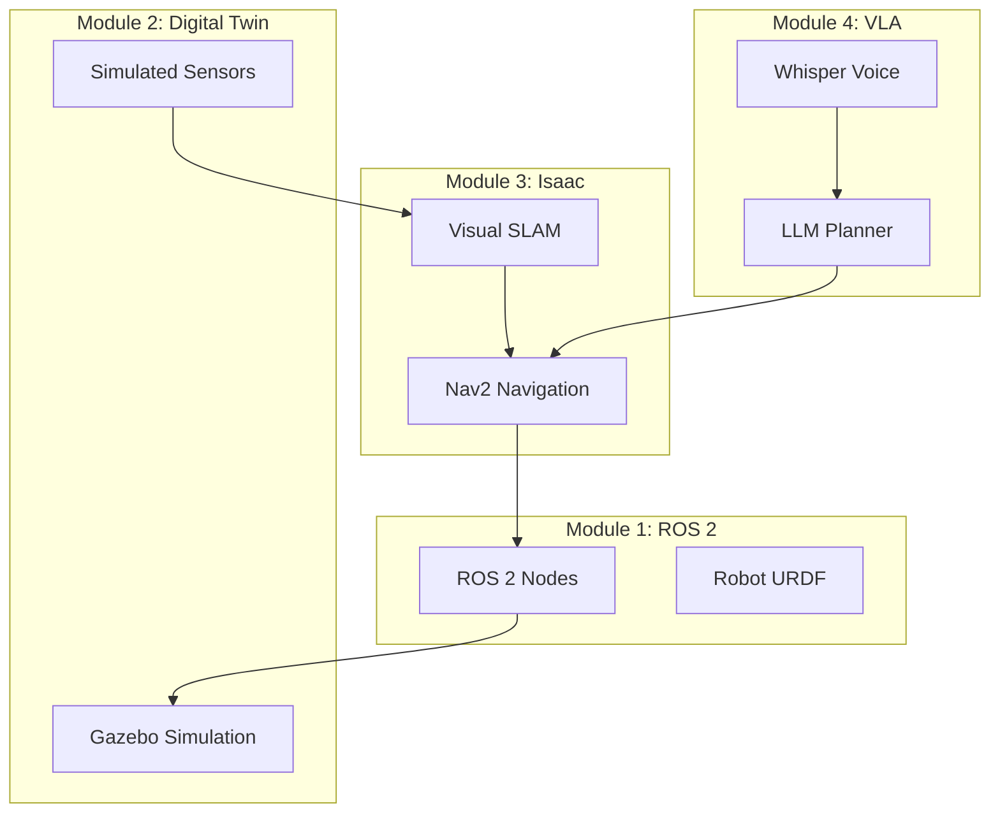

# Capstone: The Autonomous Humanoid

:::tip Capstone Objective
Build a complete workflow where a **voice command** triggers **path planning**, **object identification**, and **manipulation** — the culmination of all four modules.
:::

## System Architecture



## Complete System Integration

```python
#!/usr/bin/env python3
"""
The Autonomous Humanoid: Complete VLA System

This capstone integrates:
- Voice recognition (Whisper)
- LLM task planning (GPT-4)
- Visual SLAM localization
- Nav2 navigation
- Object detection and manipulation
"""

import rclpy
from rclpy.node import Node
from rclpy.action import ActionClient
from rclpy.executors import MultiThreadedExecutor

from std_msgs.msg import String
from sensor_msgs.msg import Image
from geometry_msgs.msg import PoseStamped
from nav2_msgs.action import NavigateToPose

import whisper
import json
from openai import OpenAI
from cv_bridge import CvBridge
import numpy as np
import threading


class AutonomousHumanoid(Node):
    """
    The complete autonomous humanoid robot system.
    
    Workflow:
    1. Listen for voice commands
    2. Parse with LLM into action plan
    3. Execute actions (navigate, detect, manipulate)
    4. Report status via speech
    """
    
    def __init__(self):
        super().__init__('autonomous_humanoid')
        
        # ========== INITIALIZATION ==========
        self.get_logger().info('Initializing Autonomous Humanoid...')
        
        # Voice Recognition (Module 4)
        self.whisper = whisper.load_model("base")
        
        # LLM Planner (Module 4)
        self.openai = OpenAI()
        
        # Computer Vision
        self.cv_bridge = CvBridge()
        self.detected_objects = []
        
        # ========== ROS 2 INTERFACES ==========
        
        # Navigation action client (Module 3)
        self.nav_client = ActionClient(
            self, NavigateToPose, 'navigate_to_pose'
        )
        
        # Camera subscription (Module 2)
        self.image_sub = self.create_subscription(
            Image, '/camera/rgb/image_raw',
            self.image_callback, 10
        )
        
        # Status publisher
        self.status_pub = self.create_publisher(
            String, '/humanoid/status', 10
        )
        
        # World knowledge
        self.locations = {
            'kitchen': {'x': 3.0, 'y': 2.0},
            'living_room': {'x': 0.0, 'y': 0.0},
            'bedroom': {'x': -2.0, 'y': 3.0},
            'front_door': {'x': 0.0, 'y': -3.0},
        }
        
        self.current_pose = None
        self.holding_object = None
        
        # Start voice listener
        self.voice_thread = threading.Thread(
            target=self.voice_listener, daemon=True
        )
        self.voice_thread.start()
        
        self.get_logger().info('✅ Autonomous Humanoid ready!')
        self.speak("Hello! I am ready for commands.")
    
    # ========== VOICE PROCESSING ==========
    
    def voice_listener(self):
        """Continuous voice command listener."""
        import sounddevice as sd
        
        while True:
            # Record 4 seconds of audio
            audio = sd.rec(
                int(4 * 16000),
                samplerate=16000,
                channels=1,
                dtype='float32'
            )
            sd.wait()
            
            # Transcribe
            result = self.whisper.transcribe(
                audio.flatten(),
                language='en'
            )
            text = result['text'].strip()
            
            # Check for wake word
            if 'hey robot' in text.lower():
                command = text.lower().split('hey robot')[-1].strip()
                if command:
                    self.process_command(command)
    
    def process_command(self, command: str):
        """Process voice command through LLM and execute."""
        self.get_logger().info(f'📢 Command: "{command}"')
        self.speak(f"I heard: {command}")
        
        # Get action plan from LLM
        plan = self.plan_with_llm(command)
        
        if not plan:
            self.speak("I couldn't understand that command.")
            return
        
        self.speak(f"Executing {len(plan)} actions.")
        
        # Execute each action
        for i, action in enumerate(plan):
            self.get_logger().info(f'Action {i+1}: {action}')
            success = self.execute_action(action)
            
            if not success:
                self.speak(f"Action {action['skill']} failed.")
                break
        
        self.speak("Task complete!")
    
    # ========== LLM PLANNING ==========
    
    def plan_with_llm(self, command: str) -> list:
        """Use LLM to generate action plan."""
        
        system_prompt = f"""You are a humanoid robot task planner.
        
Available skills:
- navigate_to(location) - Go to: {list(self.locations.keys())}
- scan_for_objects() - Look for objects
- pick_up(object) - Grasp object
- place_down() - Release held object
- wave() - Wave arm greeting
- speak(message) - Say something

Current state:
- Location: {self.current_pose}
- Holding: {self.holding_object}
- Detected objects: {self.detected_objects}

Convert command to JSON action list:
[{{"skill": "...", "args": {{...}}}}]
"""
        
        try:
            response = self.openai.chat.completions.create(
                model="gpt-4",
                messages=[
                    {"role": "system", "content": system_prompt},
                    {"role": "user", "content": command}
                ],
                temperature=0.1
            )
            
            plan_text = response.choices[0].message.content
            
            # Extract JSON from response
            import re
            json_match = re.search(r'\[.*\]', plan_text, re.DOTALL)
            if json_match:
                return json.loads(json_match.group())
            
        except Exception as e:
            self.get_logger().error(f'LLM error: {e}')
        
        return []
    
    # ========== ACTION EXECUTION ==========
    
    def execute_action(self, action: dict) -> bool:
        """Execute a single action."""
        skill = action['skill']
        args = action.get('args', {})
        
        if skill == 'navigate_to':
            return self.navigate_to(args.get('location'))
        
        elif skill == 'scan_for_objects':
            return self.scan_for_objects()
        
        elif skill == 'pick_up':
            return self.pick_up(args.get('object'))
        
        elif skill == 'place_down':
            return self.place_down()
        
        elif skill == 'wave':
            return self.wave()
        
        elif skill == 'speak':
            return self.speak(args.get('message', ''))
        
        return False
    
    def navigate_to(self, location: str) -> bool:
        """Navigate to a named location."""
        if location not in self.locations:
            self.get_logger().warn(f'Unknown location: {location}')
            return False
        
        coords = self.locations[location]
        self.get_logger().info(f'Navigating to {location}...')
        
        goal = NavigateToPose.Goal()
        goal.pose.header.frame_id = 'map'
        goal.pose.pose.position.x = coords['x']
        goal.pose.pose.position.y = coords['y']
        goal.pose.pose.orientation.w = 1.0
        
        future = self.nav_client.send_goal_async(goal)
        rclpy.spin_until_future_complete(self, future, timeout_sec=30.0)
        
        return True
    
    def scan_for_objects(self) -> bool:
        """Scan environment for objects."""
        self.get_logger().info('Scanning for objects...')
        # Would use object detection model here
        self.detected_objects = ['cup', 'book', 'remote']
        return True
    
    def pick_up(self, obj: str) -> bool:
        """Pick up an object."""
        self.get_logger().info(f'Picking up {obj}...')
        self.holding_object = obj
        return True
    
    def place_down(self) -> bool:
        """Place held object."""
        self.get_logger().info(f'Placing {self.holding_object}...')
        self.holding_object = None
        return True
    
    def wave(self) -> bool:
        """Wave greeting."""
        self.get_logger().info('Waving...')
        return True
    
    def speak(self, message: str) -> bool:
        """Text-to-speech output."""
        self.get_logger().info(f'🔊 Speaking: "{message}"')
        # Would use TTS here
        
        status_msg = String()
        status_msg.data = message
        self.status_pub.publish(status_msg)
        
        return True
    
    # ========== PERCEPTION ==========
    
    def image_callback(self, msg: Image):
        """Process camera images for object detection."""
        try:
            image = self.cv_bridge.imgmsg_to_cv2(msg, 'bgr8')
            # Object detection would run here
        except Exception as e:
            pass


def main():
    rclpy.init()
    
    humanoid = AutonomousHumanoid()
    
    executor = MultiThreadedExecutor()
    executor.add_node(humanoid)
    
    try:
        executor.spin()
    except KeyboardInterrupt:
        pass
    finally:
        humanoid.destroy_node()
        rclpy.shutdown()


if __name__ == '__main__':
    main()
```

## Example Interactions

| Voice Command | LLM Plan | Result |
|--------------|----------|--------|
| "Go to the kitchen" | `[{navigate_to: kitchen}]` | Robot navigates |
| "Find my cup" | `[{scan_for_objects}, {speak: "I see a cup"}]` | Scans and reports |
| "Bring me a book from the bedroom" | `[{navigate_to: bedroom}, {scan_for_objects}, {pick_up: book}, {navigate_to: living_room}]` | Full retrieval |

## 🎓 Congratulations!

:::tip Course Complete
You have built **The Autonomous Humanoid** — a robot that:

1. ✅ **Hears** voice commands (Whisper)
2. ✅ **Understands** natural language (LLM)
3. ✅ **Plans** action sequences
4. ✅ **Navigates** using SLAM and Nav2
5. ✅ **Perceives** the environment
6. ✅ **Acts** in the physical world

This is the foundation of Physical AI — the convergence of language, vision, and action.
:::

---

**[Return to Introduction →](/docs/intro)**


