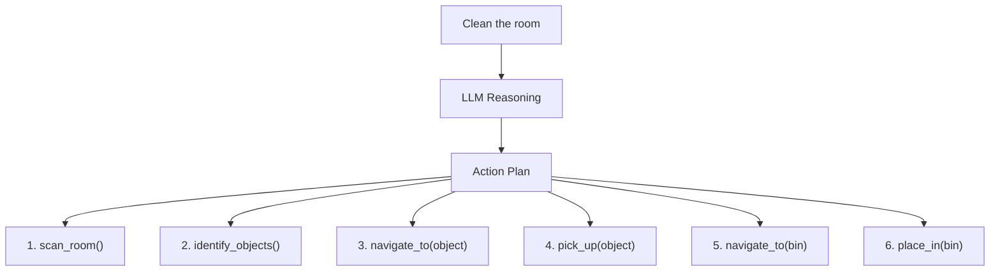

# Cognitive Logic: LLM-Powered Robot Reasoning

:::tip Learning Objective
Use Large Language Models to translate natural language commands into executable ROS 2 action sequences.
:::

## The Language-to-Action Pipeline



## LLM Task Planner

```python
#!/usr/bin/env python3
"""LLM-based task planner for robot actions."""

import rclpy
from rclpy.node import Node
from std_msgs.msg import String
import json
from openai import OpenAI


SYSTEM_PROMPT = """You are a robot task planner. Convert natural language commands 
into a JSON array of executable robot actions.

Available robot skills:
- navigate_to(location: str) - Move to a location
- scan_area() - Look around and identify objects
- pick_up(object: str) - Grasp an object
- place_on(surface: str) - Place held object on surface
- open_gripper() - Open the gripper
- close_gripper() - Close the gripper
- say(message: str) - Speak a message
- wait(seconds: float) - Wait for duration

Respond ONLY with a JSON array of actions. Example:
[
  {"skill": "scan_area", "args": {}},
  {"skill": "navigate_to", "args": {"location": "kitchen"}},
  {"skill": "pick_up", "args": {"object": "cup"}}
]
"""


class LLMTaskPlanner(Node):
    """Plan robot tasks using LLM reasoning."""
    
    def __init__(self):
        super().__init__('llm_task_planner')
        
        # OpenAI client
        self.client = OpenAI()
        
        # Subscribe to voice commands
        self.command_sub = self.create_subscription(
            String, '/voice/command',
            self.command_callback, 10
        )
        
        # Publish action plans
        self.plan_pub = self.create_publisher(
            String, '/robot/action_plan', 10
        )
        
        self.get_logger().info('LLM Task Planner ready')
    
    def command_callback(self, msg: String):
        """Process natural language command."""
        command = msg.data
        self.get_logger().info(f'Planning for: "{command}"')
        
        # Get plan from LLM
        plan = self.plan_task(command)
        
        if plan:
            # Publish plan
            plan_msg = String()
            plan_msg.data = json.dumps(plan)
            self.plan_pub.publish(plan_msg)
            
            self.get_logger().info(f'Generated {len(plan)} actions')
    
    def plan_task(self, command: str) -> list:
        """Use LLM to create action plan."""
        try:
            response = self.client.chat.completions.create(
                model="gpt-4",
                messages=[
                    {"role": "system", "content": SYSTEM_PROMPT},
                    {"role": "user", "content": command}
                ],
                temperature=0.1
            )
            
            plan_text = response.choices[0].message.content
            plan = json.loads(plan_text)
            
            return plan
            
        except Exception as e:
            self.get_logger().error(f'Planning failed: {e}')
            return []


def main():
    rclpy.init()
    node = LLMTaskPlanner()
    rclpy.spin(node)
    rclpy.shutdown()


if __name__ == '__main__':
    main()
```

## Action Executor

```python
#!/usr/bin/env python3
"""Execute action plans from LLM planner."""

import rclpy
from rclpy.node import Node
from rclpy.action import ActionClient
from std_msgs.msg import String
from geometry_msgs.msg import PoseStamped
from nav2_msgs.action import NavigateToPose
import json
import time


class ActionExecutor(Node):
    """Execute robot action plans."""
    
    def __init__(self):
        super().__init__('action_executor')
        
        # Subscribe to action plans
        self.plan_sub = self.create_subscription(
            String, '/robot/action_plan',
            self.plan_callback, 10
        )
        
        # Action clients
        self.nav_client = ActionClient(
            self, NavigateToPose, 'navigate_to_pose'
        )
        
        # Known locations
        self.locations = {
            'kitchen': (3.0, 2.0),
            'living_room': (0.0, 0.0),
            'bedroom': (-2.0, 3.0),
            'bin': (1.0, -1.0),
        }
        
        self.get_logger().info('Action Executor ready')
    
    def plan_callback(self, msg: String):
        """Execute received action plan."""
        plan = json.loads(msg.data)
        
        for i, action in enumerate(plan):
            self.get_logger().info(
                f'Executing action {i+1}/{len(plan)}: {action["skill"]}'
            )
            self.execute_action(action)
    
    def execute_action(self, action: dict):
        """Execute a single action."""
        skill = action['skill']
        args = action.get('args', {})
        
        if skill == 'navigate_to':
            self.navigate_to(args['location'])
            
        elif skill == 'scan_area':
            self.scan_area()
            
        elif skill == 'pick_up':
            self.pick_up(args['object'])
            
        elif skill == 'place_on':
            self.place_on(args['surface'])
            
        elif skill == 'say':
            self.say(args['message'])
            
        elif skill == 'wait':
            time.sleep(args['seconds'])
    
    def navigate_to(self, location: str):
        """Navigate to named location."""
        if location in self.locations:
            x, y = self.locations[location]
            self.get_logger().info(f'Navigating to {location} ({x}, {y})')
            
            goal = NavigateToPose.Goal()
            goal.pose.header.frame_id = 'map'
            goal.pose.pose.position.x = x
            goal.pose.pose.position.y = y
            goal.pose.pose.orientation.w = 1.0
            
            self.nav_client.send_goal_async(goal)
    
    def scan_area(self):
        """Rotate and scan surroundings."""
        self.get_logger().info('Scanning area...')
        # Rotate head or body to scan
    
    def pick_up(self, obj: str):
        """Pick up an object."""
        self.get_logger().info(f'Picking up: {obj}')
        # Execute manipulation
    
    def place_on(self, surface: str):
        """Place object on surface."""
        self.get_logger().info(f'Placing on: {surface}')
        # Execute placement
    
    def say(self, message: str):
        """Speak a message."""
        self.get_logger().info(f'Saying: "{message}"')
        # Text-to-speech


def main():
    rclpy.init()
    node = ActionExecutor()
    rclpy.spin(node)
    rclpy.shutdown()


if __name__ == '__main__':
    main()
```

---

**Next:** [Capstone: The Autonomous Humanoid →](./capstone)


