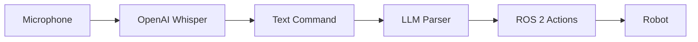

# Voice Pipeline: OpenAI Whisper Integration

:::tip Learning Objective
Build a voice command pipeline using OpenAI Whisper for natural robot interaction.
:::

## Voice-Controlled Robotics



## Whisper Integration

```python
#!/usr/bin/env python3
"""Voice command pipeline using OpenAI Whisper."""

import rclpy
from rclpy.node import Node
from std_msgs.msg import String
import whisper
import numpy as np
import sounddevice as sd
from queue import Queue
import threading


class VoiceCommandNode(Node):
    """ROS 2 node for voice command recognition."""
    
    def __init__(self):
        super().__init__('voice_command_node')
        
        # Load Whisper model
        self.get_logger().info('Loading Whisper model...')
        self.model = whisper.load_model("base")
        self.get_logger().info('Whisper model loaded!')
        
        # Publisher for recognized commands
        self.command_pub = self.create_publisher(
            String, '/voice/command', 10
        )
        
        # Audio parameters
        self.sample_rate = 16000
        self.channels = 1
        self.audio_queue = Queue()
        
        # Start listening
        self.listening = True
        self.listen_thread = threading.Thread(target=self._listen_loop)
        self.listen_thread.start()
        
        self.get_logger().info('Voice command node ready. Say a command!')
    
    def _listen_loop(self):
        """Continuous listening loop."""
        while self.listening:
            # Record audio chunk (3 seconds)
            audio = self._record_audio(duration=3.0)
            
            # Transcribe with Whisper
            text = self._transcribe(audio)
            
            if text and len(text.strip()) > 0:
                self._process_command(text)
    
    def _record_audio(self, duration: float) -> np.ndarray:
        """Record audio from microphone."""
        frames = int(duration * self.sample_rate)
        audio = sd.rec(
            frames, 
            samplerate=self.sample_rate,
            channels=self.channels,
            dtype='float32'
        )
        sd.wait()
        return audio.flatten()
    
    def _transcribe(self, audio: np.ndarray) -> str:
        """Transcribe audio using Whisper."""
        result = self.model.transcribe(
            audio,
            language='en',
            fp16=False
        )
        return result['text'].strip()
    
    def _process_command(self, text: str):
        """Process and publish recognized command."""
        self.get_logger().info(f'Heard: "{text}"')
        
        # Publish raw transcription
        msg = String()
        msg.data = text
        self.command_pub.publish(msg)
    
    def destroy_node(self):
        """Clean shutdown."""
        self.listening = False
        self.listen_thread.join()
        super().destroy_node()


def main():
    rclpy.init()
    node = VoiceCommandNode()
    
    try:
        rclpy.spin(node)
    except KeyboardInterrupt:
        pass
    finally:
        node.destroy_node()
        rclpy.shutdown()


if __name__ == '__main__':
    main()
```

## Wake Word Detection

```python
#!/usr/bin/env python3
"""Wake word detection before command recognition."""

import numpy as np
from dataclasses import dataclass


@dataclass
class WakeWordConfig:
    wake_phrase: str = "hey robot"
    threshold: float = 0.8


class WakeWordDetector:
    """Detect wake word before processing commands."""
    
    def __init__(self, config: WakeWordConfig):
        self.config = config
        self.is_activated = False
        self.activation_timeout = 5.0  # seconds
    
    def check_wake_word(self, transcription: str) -> bool:
        """Check if transcription contains wake word."""
        text = transcription.lower().strip()
        
        if self.config.wake_phrase in text:
            self.is_activated = True
            return True
        
        return False
    
    def extract_command(self, transcription: str) -> str:
        """Extract command after wake word."""
        text = transcription.lower()
        
        if self.config.wake_phrase in text:
            # Get text after wake phrase
            idx = text.find(self.config.wake_phrase)
            command = text[idx + len(self.config.wake_phrase):].strip()
            return command
        
        return transcription.strip()


# Usage
detector = WakeWordDetector(WakeWordConfig())
text = "Hey robot, pick up the cup"

if detector.check_wake_word(text):
    command = detector.extract_command(text)
    print(f"Command: {command}")  # "pick up the cup"
```

---

**Next:** [Cognitive Logic with LLMs →](./cognitive-logic)


